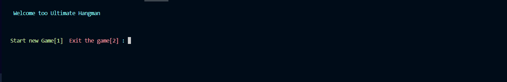
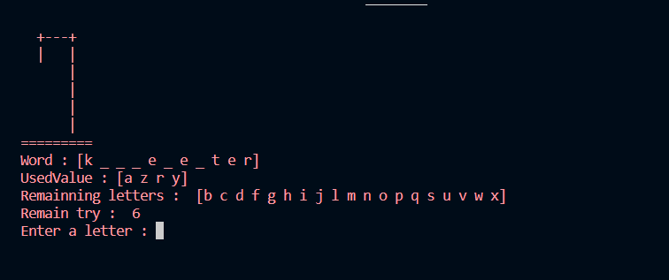

# Hangman 

***

**Members** 

1. Gabriel Comb
2. Tom Saillard
3. Gurvan Nicolas

***

 Extra informations : Tom had a problem during all the project, sometimes he can't push / commit and also pull. And sometimes it works and solve his problem himself. So he was sended his program to Gurvan on Discord 

***

The project is a Hangman made for school 

When the function main is run the Hangman Display a menu with two steps, if the player want to enter in the game 
 

The next step is to choose the type of ascii art or not ascii art 

Next, the player choose the difficulty or if he want to load his save.

The game start after this step 

***

If the player win he can put a word in the Data Base

 The Display of ascii Art print this : 

The project teach us how to use Data Base, Team Work, This project renforce our skills and our proximity in the class 

